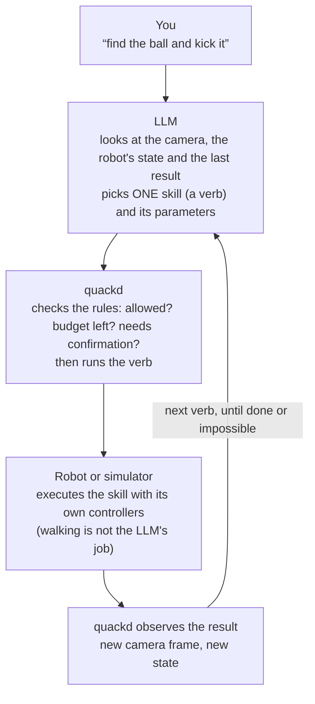
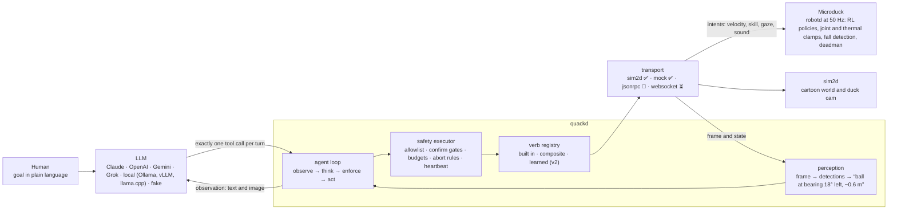
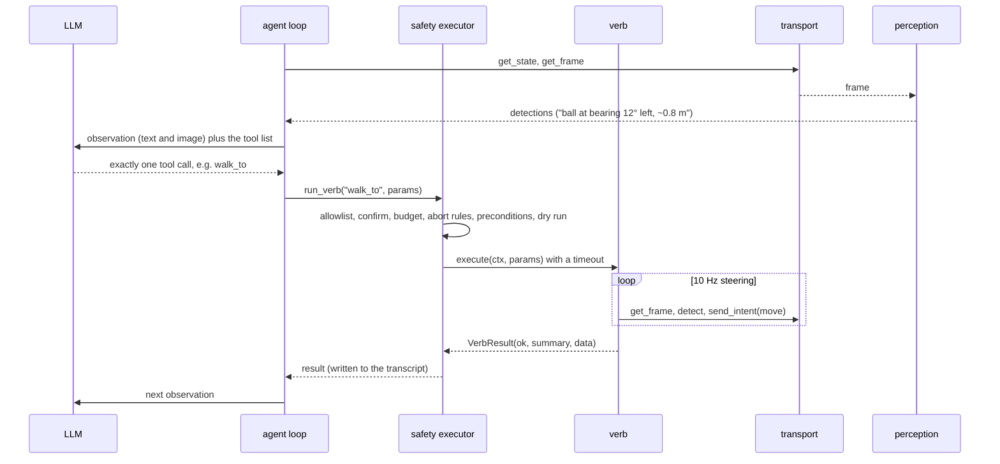

<p align="center">
  
</p>

<p align="center"><strong>Give your Microduck a brain. Any LLM, one <code>.duck</code> file.</strong> 🦆🧠<br>
<sub>quackd, pronounced “quacked”. The brain daemon Microduck was missing, named like its siblings <code>robotd</code>, <code>mediad</code>, <code>padd</code> and <code>tofd</code>.</sub></p>

<p align="center">Tell a small robot what you want in plain language. An AI uses the robot's existing skills to do it.</p>

<p align="center">
  <a href="https://github.com/rokbenko/quackd/actions/workflows/ci.yml"></a>
  <a href="https://pypi.org/project/quackd/"></a>
  <a href="https://pypi.org/project/quackd/"></a>
  <a href="LICENSE"></a>
  <a href="docs/mcp.md"></a>
  <a href="docs/local-llms.md"></a>
  <a href="https://github.com/pollen-robotics/microduck#readme"></a>
</p>

<p align="center">
  
  <br>
  <sub>"Find the ball and kick it", in the bundled simulator, driven by the <em>scripted</em> pilot (no API key). Same verbs, same safety layer, same perception as a real model run. See <a href="docs/assets/README.md">docs/assets</a>.</sub>
</p>

**quackd** connects a small robot with two legs, the [Microduck](https://pollen-robotics.com/microduck/) from Pollen Robotics, to a large language model (Claude, OpenAI, Gemini, Grok, or an open source model running locally through llama.cpp, vLLM, Ollama or LM Studio). The robot already knows how to walk, turn, kick, scoop something off the floor, look around and quack. quackd is the missing layer that turns a request like *"find the ball and kick it"* into the right sequence of those skills, watches what happens, and keeps going until the job is done or it is clearly impossible.

You do not need a robot to try it. A bundled simulator runs on any laptop in seconds. Goals that work today, in that simulator:

> **"Find the ball and kick it."** · **"Patrol, and quack twice if you see someone."** · **"Follow the person."** · **"Fetch the ball"** *(experimental, because the scoop is unreliable on purpose)*

Runs with a cloud model or with an open source model on your own machine (Ollama, vLLM, llama.cpp, LM Studio). The local path needs no API key.

Goals like *"find my keys"* or *"pick up the trash"* are where this is going, **not** what it does yet. The robot ships at Christmas 2026 and nothing here has run on real hardware. The honest label for today is *LLM driven, goal directed control of a simulated robot*: an early, working step toward a small robot you can simply talk to.

<br>

## Try it in 60 seconds

```bash
uvx quackd run find-and-kick --provider fake                                        # no key: the scripted pilot
uvx --from "quackd[anthropic]" quackd run find-and-kick --provider anthropic --robot microduck:sim2d   # needs ANTHROPIC_API_KEY
uvx --from "quackd[openai]" quackd run find-and-kick --provider ollama --model qwen3:8b          # local model, no key
open runs/*/run.gif                                                                 # every run leaves a GIF and a transcript
```

Put keys in the environment or in a `.env` file (copy [`.env.example`](.env.example)). `quackd doctor` tells you what is missing. Needs Python 3.11 or newer and [`uv`](https://docs.astral.sh/uv/), nothing else.

<br>

## Why?

A modern small robot is not short of skills. The Microduck's onboard controllers already balance it, walk, kick, sit, stand up after a fall and scoop with its beak. Each is a trained policy that works without any help from an AI model. What the robot lacks is any idea of **what those skills are for**.

```
Traditional control:   walk forward, turn left, walk, look down, scoop, ...   (you plan every step)
This project:          "Pick up the ball."                                    (you state the goal)
```

Low level skills and high level goals are different layers. The robot knows the words, but it cannot hold a conversation. quackd is an open source attempt to connect the two layers, with an LLM doing the planning and the robot's own controllers doing the moving.

<br>

## What is this?

**The robot.** The Microduck is a 25 cm, 800 g biped shaped like a duck: fifteen small servos, a camera in its head, a depth sensor, a speaker, an onboard computer, and a set of learned behaviours (walk, kick, sit and stand, ground pick, roll, roller skate with clip on wheels) that run at 50 Hz on the robot itself. It is open source, costs about $399, and is deliberately small and friendly, the opposite of an intimidating humanoid. The bigger bet behind projects like this one is that *useful* robots at home or in an office will be small ones people actually enjoy having around.

**This project.** quackd (pronounced "quacked", named after the robot's daemons `robotd`, `mediad`, `padd` and friends) is an independent, unofficial brain for it. It is a Python program that

- takes a goal in plain language, from a chat, a command line, or a `.duck` task file,
- asks an LLM, cloud or local, one step at a time, which of the robot's skills to use next,
- runs that skill on the robot (or the simulator), looks at the camera, and asks again,
- enforces a contract the model cannot talk its way out of: which skills are allowed, how many steps, when a human must say yes, when to abort.

It ships with a cartoon simulator so all of this can be developed and demoed before the hardware exists, and with an [MCP](https://modelcontextprotocol.io) server so Claude Code or Claude Desktop can drive the duck interactively.

<br>

## How it works (the simple version)



The verbs the model can pick from are real, existing capabilities and nothing more:

| Kind | Verbs | What they are |
|---|---|---|
| Core | `observe` `report_state` `stop` `say` `move` `go_to` `search_scan` `approach_and` | on any robot whose manifest satisfies their requirements (a camera, a twist intent, a sound intent). `go_to` and `search_scan` are plain Python over the camera, the steering loop |
| Microduck | `sit` `stand` `stand_up` `kick` `grab` `gaze` `quack` | one each per behaviour the robot ships with, each an *intent* the robot's own controllers execute |
| Aliases | `get_frame` `walk_to` `walk` | the 0.3 names of `observe`, `go_to` and `move`. They keep working in every `.duck` file |
| Learned | *(none yet)* | v2: policies trained from LLM written rewards, registered like any other verb |

`go_to` (still spelled `walk_to` in the starter files) deserves a mention. It is a small closed loop written in plain Python that steers toward whatever the camera sees, ten times a second, without asking the model. The LLM says *"go to the ball"*. It never has to say *"turn 4° left"*.

<br>

## Example

The hero run above, from its transcript (`runs/<timestamp>/transcript.jsonl`). This one is the scripted pilot, so `model` says so.

```jsonc
{"kind": "llm",  "step": 0, "tool_calls": [{"name": "search_scan", "arguments": {"target": "ball"}}], "usage": {"input_tokens": 689, "output_tokens": 16}}
{"kind": "verb", "step": 1, "name": "search_scan", "ok": true, "summary": "ball found: ball at bearing 18° left ~0.58 m (after 4 turn steps)"}
{"kind": "llm",  "step": 1, "tool_calls": [{"name": "walk_to", "arguments": {"target": "ball", "stop_distance": 0.22}}]}
{"kind": "verb", "step": 2, "name": "walk_to", "ok": true, "summary": "reached the ball: ~0.22 m away, bearing +0°", "data": {"distance_m": 0.217, "ticks": 27}}
{"kind": "llm",  "step": 2, "tool_calls": [{"name": "kick", "arguments": {"leg": "right"}}]}
{"kind": "verb", "step": 3, "name": "kick", "ok": true, "summary": "kicked with right leg, ball moved 0.53 m"}
{"kind": "llm",  "step": 3, "tool_calls": [{"name": "quack", "arguments": {"text": "yay, got it!"}}]}
{"kind": "llm",  "step": 4, "tool_calls": [{"name": "declare_success", "arguments": {"reason": "ball displaced by the kick"}}]}
```

The same thing as a conversation, through MCP in Claude Code or Claude Desktop:

> **You:** List the duck's verbs, then find the ball and kick it.
> **Claude:** *(calls `duck_list_verbs`, `duck_get_frame`, `duck_run_verb("search_scan")`, `duck_run_verb("walk_to")`, `duck_run_verb("kick")`, `duck_quack`)* Done. The ball moved about half a metre.

<br>

## What it can do today, and where it is going

**Today (v0.3, simulator):**

- Run a goal end to end in the bundled 2D simulator with any of five providers. `find-and-kick` succeeds on 10 of 10 seeds with the scripted pilot, in about 2 s of wall clock per run, with a GIF and a full transcript every time.
- Fifteen verbs (eight core, seven Microduck extensions), a strict `.duck` task file format with a validator, and a safety layer that enforces allowlists, budgets, confirmation gates, a heartbeat and a kill switch.
- Drive the duck interactively from Claude Code or Claude Desktop over MCP, under the same rules.
- Local and open source models through Ollama, vLLM, llama.cpp, LM Studio or any OpenAI compatible server, with no API key, model discovery from the server, and a JSON text fallback for models that cannot call tools natively.
- Real model code paths for Claude, OpenAI, Gemini and Grok are implemented and tested offline. The hero GIF is the scripted pilot because this repo was built without an API key.
- Run a flock: multiple simulated ducks coordinate over a message bus and a deterministic auction, each duck acting only through the verbs it already has. One choreography ships today, `flock-kick`, 10 of 10 seeds with the scripted pilot, and every message lands in `flock.jsonl`.
- Drive a second body. Robots are adapters that declare a manifest, and the verbs come from the manifest. A Reachy Mini head runs `reachy-spotter` in the simulator on 10 of 10 seeds, and `quackd validate --robot` tells you which verbs a task needs that a robot does not have.

**Going (see [Roadmap](#roadmap)):** the same five tasks on the real robot once it ships, upstream's WebSocket agent surface, and *learned verbs*, new skills trained from LLM written rewards that register as one more verb. Eventually, a small robot in a real room that you can ask to find, fetch, follow and check on things.

| Piece | Status |
|---|---|
| `sim2d` bundled simulator (default) | ✅ 10 of 10 seeds on `find-and-kick`, GIF and transcript per run |
| MCP server (`quackd serve-mcp`) | ✅ Claude Code and Claude Desktop, verified config, fleets with `--robots` (six `robot_*` tools, tested in process against the simulator and the mocks) |
| Providers: anthropic, openai, gemini, grok, fake | ✅ implemented, tested offline, real model hero recording pending an API key |
| Local models (Ollama, vLLM, llama.cpp, LM Studio, any OpenAI compatible server) | ✅ implemented and tested against the OpenAI wire format, 🧪 not yet exercised against a live server by us, transcripts welcome |
| Flock mode (multiple cooperating ducks, sim2d) | ✅ deterministic auction and bus, one planner LLM call at most, ground truth checked in tests, 🧪 experimental and simulator only |
| Real robot over JSON RPC (`--robot microduck:jsonrpc`) | 🧪 experimental, method names verified against upstream `duck-ipc-proto` v16, never run on hardware |
| WebSocket agent gateway (`--robot microduck:websocket`) | ⏳ stub tracking upstream's draft ([architecture.md §5.3](https://github.com/pollen-robotics/microduck/blob/main/docs/design/architecture.md)) |
| Reachy Mini adapter (`--robot reachy_mini:sim2d`, `mock`, `sdk`) | ✅ sim2d and mock, `reachy-spotter` 10 of 10 seeds, 🧪 sdk with every SDK name verified against a pinned commit, never run on a robot ([docs/adapters/reachy_mini.md](docs/adapters/reachy_mini.md)) |
| Heterogeneous flock (a Reachy Mini head and a Microduck, sim2d) | ✅ `reachy-spots-duck-kicks` 10 of 10 seeds, capability aware auction, the spotter judges from its own frames, ground truth vetoes, 🧪 simulator only |
| LAN discovery (`quackd discover`, `quackd announce`, `quackd[lan]`) | ✅ record format and both commands on fakes in the suite, 🧪 real zeroconf exercised once between two processes on one machine, never between two machines |
| MQTT flock bus (`MqttBus`, library only) | ✅ every message kind, echo, duplicates and a full flock run on a fake broker, 🧪 one real round trip against a local `amqtt` broker, never a flock across machines (no distributed clock yet) |
| Learned verbs | 🗺️ v2, interface and docs only ([docs/learned-verbs.md](docs/learned-verbs.md)) |

Everything quackd assumes about the robot's API, and how sure we are: [docs/transport-status.md](docs/transport-status.md). `quackd doctor` prints the same list for your machine.

<br>

## Architecture

Three loops, three rates, three owners. The LLM decides **what**. The steering loop decides **how to get there**. The robot's own policies keep it **upright**.

| Loop | Rate | Where | Who |
|---|---|---|---|
| Reflexes | 50 Hz | onboard `robotd` | RL policies (ONNX): balance, gait, stand up. quackd never touches this. |
| Steering | 5 to 20 Hz | quackd process | perception and composite verbs (`walk_to` closes the approach loop from detections) |
| Deliberation | 0.2 to 1 Hz | LLM | reads a frame and the state, picks the next **verb**, judges the success criteria |



**One turn, concretely.**



**Why predefined skills matter.** The LLM never generates motor commands. Every built in verb is an *intent* the robot already understands: a velocity, a named skill (`kick_left`, `ground_pick`, `sit_toggle`), a gaze target, a sound. The robot's onboard policies (trained in [microduck_rl](https://github.com/pollen-robotics/microduck_rl), exported to ONNX, `obs[61] → act[14]` at 50 Hz) do the physical part. A slow or confused model degrades the *task*, never the *balance*, and the robot's own deadman stops it if commands stall.

**Enforcement order.** `Executor.run_verb` applies the contract in this order: abort flag, allowlist, parameter validation (errors go back to the model as feedback), confirm gate, budgets, machine enforced `abort_when`, preconditions (not fallen, not sitting), dry run, then execution with a timeout. Every result is written to the transcript and becomes the next observation.

**Prompts.** The system prompt is the contract in prose (allowed verbs, budgets, confirm list, success criteria, the enforced and advisory abort conditions, the persona) followed by the `.duck` body verbatim. Tools are JSON schema definitions generated from each verb's parameter model, plus `declare_success(reason)` and `declare_failure(reason)`. The model must return exactly one tool call (`tool_choice=any` with parallel calls disabled on Claude, `tool_choice=required` on OpenAI compatible APIs, `mode=ANY` on Gemini). Only the last two observations keep their images. For local models the prompt adds one line with the exact JSON shape to answer with if native tool calling is unavailable, and quackd parses that shape back into a verb. Everything is in [`quackd/agent/prompts.py`](quackd/agent/prompts.py).

**Perception: features, not frames.** The default detector is an HSV colour threshold, about 1 ms per frame, no model download. Bearing comes from horizontal position through the camera's focal length. Distance comes from apparent size. The simulator draws the ball in a known orange, so it works out of the box. For a real ball you tune one HSV range ([FAQ](docs/faq.md)). A YOLO detector is an optional extra. Composite verbs steer on these detections at 10 Hz and never wait for the model.

**Talking to the robot.** `robotd` speaks JSON RPC 2.0, one object per line, over a unix socket. quackd sends `robot.move` as a *notification* every 100 ms while walking (the robot zeroes velocity if these stop, its deadman, kept on purpose), `robot.do{skill}`, `robot.look`, `robot.sound{tag}`, and polls `robot.health` every 500 ms as its heartbeat. Every upstream name lives in one file, tagged VERIFIED (read from upstream source) or UNVERIFIED, and a test proves the unverified ones are only reachable from the experimental transports.

**Safety layer.** Heartbeat failure means `stop` plus abort. Ctrl+C or `q` means `stop` plus abort. A verb timeout or exception means `stop` plus a failed result. `--dry-run` sends nothing. The gamepad keeps authority on hardware. Details: [docs/safety.md](docs/safety.md).

The full map, with a "why it exists" line per module: [docs/architecture.md](docs/architecture.md). Decisions and their reasons: [docs/adr/](docs/adr/).

<br>

## Installation

Requirements: Python 3.11 or newer and [`uv`](https://docs.astral.sh/uv/). Windows, macOS and Linux. No GPU. The default install is about 250 MB (OpenCV is most of it). Provider SDKs are optional extras so `uvx` stays fast.

```bash
uvx quackd --version                                   # nothing to install, uvx fetches it
uv pip install "quackd[anthropic]"                     # or: openai, gemini, grok, all, yolo, live
git clone https://github.com/rokbenko/quackd && cd quackd && uv sync --extra dev   # contributors
```

<br>

## Usage

```bash
# a goal in plain language (bundled simulator, scripted pilot, no key needed)
uvx quackd run --goal "find the ball and kick it" --provider fake

# the same goal with Claude
uvx --from "quackd[anthropic]" quackd run --goal "find the ball and kick it" --provider anthropic

# a task file (five ship with the package: hello-world, find-and-kick, patrol-and-quack, follow-me, fetch)
uvx quackd run find-and-kick --provider fake --seed 3
```

Every run writes `runs/<timestamp>/` with `transcript.jsonl` (every prompt, tool call, result and token count), the frames the model saw, `summary.json`, and `run.gif` on the simulator.

Cloud or local, same command.

| Provider | Extra | Key | Run |
|---|---|---|---|
| Claude | `quackd[anthropic]` | `ANTHROPIC_API_KEY` | `uvx --from "quackd[anthropic]" quackd run find-and-kick --provider anthropic` |
| OpenAI | `quackd[openai]` | `OPENAI_API_KEY` | `uvx --from "quackd[openai]" quackd run find-and-kick --provider openai` |
| Gemini | `quackd[gemini]` | `GEMINI_API_KEY` | `uvx --from "quackd[gemini]" quackd run find-and-kick --provider gemini` |
| Grok | `quackd[grok]` | `XAI_API_KEY` | `uvx --from "quackd[grok]" quackd run find-and-kick --provider grok` |
| fake (scripted) | none | none | `uvx quackd run find-and-kick --provider fake` |
| Ollama (local) | `quackd[openai]` | none | `uvx --from "quackd[openai]" quackd run find-and-kick --provider ollama --model qwen3:8b` |
| vLLM (local) | `quackd[openai]` | none | `uvx --from "quackd[openai]" quackd run find-and-kick --provider vllm --model Qwen/Qwen3-8B` |
| llama.cpp (local) | `quackd[openai]` | none | `uvx --from "quackd[openai]" quackd run find-and-kick --provider llamacpp` |
| LM Studio (local) | `quackd[openai]` | none | `uvx --from "quackd[openai]" quackd run find-and-kick --provider lmstudio` |
| any OpenAI compatible server | `quackd[openai]` | optional | `uvx --from "quackd[openai]" quackd run find-and-kick --provider local --base-url http://host:8000/v1` |

The four cloud providers see the camera frame as an image. Local models get the text detections by default and the frame too with `--vision`. The scripted pilot only reads the detection summary. Local setup, tool calling flags per server and what to expect from small models: [docs/local-llms.md](docs/local-llms.md).

| Command | What it does |
|---|---|
| `quackd run <duck>` or `quackd run --goal "..."` | Run a task. `--provider`, `--robot <adapter>:<backend>`, `--model`, `--seed`, `--max-steps`, `--dry-run`, `--yes`, `--live`, `--gif-size`, `--flock N`. `--transport X` still works as `--robot microduck:X` for one release |
| `quackd validate ducks/*.duck` | Check task files against the spec and a robot's verbs (`--robot`). Exits 1 with field level errors |
| `quackd serve-mcp` | Expose the robot as MCP tools over stdio |
| `quackd doctor` | Keys, extras, adapters, and every upstream assumption on this machine |
| `quackd list-verbs` | The vocabulary with parameters and safety classes (`--robot` for another robot) |
| `quackd list-adapters` | The robot adapters this build knows, their backends and status |
| `quackd discover` | The quackd robots answering on the LAN (zeroconf, needs `quackd[lan]`) |
| `quackd announce` | Advertise a robot's identity on the LAN (a static manifest, no robot connection) |
| `quackd record <duck>` | `run` on the simulator that always writes a GIF |

### The `.duck` file

A task file is a contract plus instructions, deliberately shaped like a SKILL.md. The YAML frontmatter is **enforced by quackd**. The Markdown body is **read by the model**.

```markdown
---
duck: 0
name: find-and-kick
description: Search the area for a ball, walk to it, kick it.
verbs:
  allow: [search_scan, walk_to, kick, quack, get_frame, stop]
  confirm: []                       # verbs that ask a human y/N first
budgets: {max_steps: 40, max_minutes: 5, max_llm_calls: 40}
success:
  - Ball displaced more than 0.3 m in sim, or human confirms the kick landed.
abort_when: [Battery below 15%, Same verb fails 3 times in a row]
persona: Determined and cheerful. Quack once when you succeed.
---
# Task
Find the ball and kick it.
## Strategy
1. `search_scan`. 2. `walk_to` the ball, stop ~0.25 m away. 3. `kick`. 4. Verify, and retry if it did not move.
```

| Starter | Goal | Notes |
|---|---|---|
| `hello-world` | quack, one step forward, quack | the smoke test |
| `find-and-kick` | find the ball and kick it | the flagship, ground truth checked in tests |
| `patrol-and-quack` | wander, quack twice on a person or pet | |
| `follow-me` | keep a person in view and follow at 0.5 m | |
| `fetch` | scoop the ball up and bring it back | **experimental**, the scoop is open loop and fails about 40 % of the time in sim, by design |
| `flock-kick` | multiple ducks split the search, the closest one kicks | **flock mode**, cooperation over a bus and an auction |
| `reachy-spotter` | find the ball with your gaze and say where it is | **Reachy Mini** (`--robot reachy_mini:sim2d` is its default), a stationary head with no legs |
| `reachy-spots-duck-kicks` | a Reachy Mini head spots the ball, a Microduck kicks it, the head judges the kick | **heterogeneous flock**, two bodies under one contract, the spotter judges and the world vetoes |

Full spec: [docs/duck-spec.md](docs/duck-spec.md). Add yours to [`ducks/`](ducks/).

### Pilot it from Claude (MCP)

```bash
claude mcp add quackd -- uvx quackd serve-mcp --robot microduck:sim2d
```

Then, in Claude Code or Claude Desktop: *"List the duck's verbs, then find the ball and kick it."* The same allowlists and budgets apply once you load a `.duck`. Pass `--robots duck=microduck:sim2d,reachy=reachy_mini:mock` to front a fleet, with one executor, budget and heartbeat per robot. Config for both clients, the six `robot_*` tools, the eight `duck_*` aliases, and a two minute script: [docs/mcp.md](docs/mcp.md).

<br>

## Flock mode (v0.3, simulator)

Multiple simulated Microducks can now work together. They talk to each other over a tiny message bus, divide up a job, and each duck contributes the skills it already has: walking, kicking, picking things up, looking around, quacking. The first choreography that ships is a kick: the flock splits the search for a ball, holds a quick auction, and the closest duck takes the shot.

```bash
uvx quackd run flock-kick --provider fake --seed 3
```

<p align="center">
  
  <br>
  <sub>The first choreography: one flock, one auction, one kicker. Scripted planner, deterministic coordinator. Every message is in the transcript.</sub>
</p>

The interesting part is not the kick, it is the talking. The ducks coordinate over an in process bus (TASK, BID, CLAIM, ROLE, HB and RESULT messages, every one logged in `flock.jsonl`), and a deterministic Contract Net auction decides which duck acts, from each duck's own camera distance estimate. Every action goes through verbs the duck already has, so the machinery is task agnostic and what a flock can do is bounded by its skills, not by the ball. The kick is simply the first choreography written on top: split the search, auction, one actor, with the target label configurable. The LLM contributes **at most one** planning call per run, and each duck still enforces the `.duck` contract on itself. The outcome is judged from sim ground truth, not from a model's claim. Add a `flock:` block to any `.duck` or pass `--flock N`. Simulator only for now, and the per duck pilots are deterministic rules, on purpose. Details: [docs/flock.md](docs/flock.md).

Since 0.4 a flock can mix bodies. In `reachy-spots-duck-kicks` a Reachy Mini head that can look but not walk and a Microduck that can walk and kick share one contract: bids carry a capability term, so each robot bids only for a role its manifest can fill, the head takes the spotter role and the duck the kicker role, the duck kicks and reports that it kicked, and the head judges from its own fresh frames whether the ball moved. Success needs the spotter's verdict and the simulator's ground truth to agree. Ten of ten seeds with the scripted pilots.

```bash
uvx quackd run reachy-spots-duck-kicks --provider fake --seed 3
```

<br>

## Configuration

| What | How |
|---|---|
| API keys | `ANTHROPIC_API_KEY`, `OPENAI_API_KEY`, `GEMINI_API_KEY`, `XAI_API_KEY` in the environment or a `.env` file (see [`.env.example`](.env.example)) |
| Model | `--model` or `QUACKD_MODEL`. Defaults: `claude-opus-5`, `gpt-5`, `gemini-2.5-pro`, `grok-4`. The OpenAI, Gemini and Grok IDs are unverified, override them if yours differ |
| Claude reasoning effort | `QUACKD_EFFORT` (`low` to `max`, default `medium`). `QUACKD_ANTHROPIC_FALLBACKS=0` disables server side refusal fallbacks |
| Local models | `--provider ollama`, `vllm`, `llamacpp`, `lmstudio` or `local --base-url http://host:port/v1`. No key. `--model` or the first served model. `--vision` sends frames. `QUACKD_TOOL_CHOICE=auto`, `required` or `none` for picky servers. See [docs/local-llms.md](docs/local-llms.md) |
| Determinism | `--seed N` makes a simulator run repeatable |
| Budgets | in the `.duck`. `--max-steps` overrides for one run |
| Human in the loop | `verbs.confirm` in the `.duck` prompts y/N. `--yes` auto accepts. MCP refuses gated verbs unless started with `--yes` |
| Dry run | `--dry-run` logs every intent and sends nothing |
| Real robot | `--robot microduck:jsonrpc --address unix:///run/robotd.sock` on the robot, or `tcp://127.0.0.1:9870` after `ssh -L 9870:/run/robotd.sock <robot>` |

<br>

## Performance

Measured on the simulator with the scripted pilot (no model latency): `find-and-kick` takes 3 to 8 decisions and 1 to 2 s of wall clock per run across seeds 0 to 9, and simulated time runs as fast as the CPU allows. With a real model, each decision is one API call. The system prompt is roughly 3 to 4 k tokens, the per turn observation a few hundred, plus one 256 px PNG for vision models, so a run is a handful of calls and the transcript records exact usage per turn. Model latency does not affect control: the steering loop runs at 10 Hz and the robot's own policies at 50 Hz regardless of how long the model thinks. That holds for local models too, where latency depends on your hardware and model size. The default install is about 250 MB, needs no GPU, and the simulator renders at 256 px (`--gif-size` for prettier GIFs).

<br>

## Limitations

- The simulator is a cartoon on purpose. It tests the agent loop, not physics, and will not tell you whether a gait works.
- Nothing has run on a real Microduck. The `jsonrpc` transport uses verified method names but is unverified end to end, posture is inferred from the policy name (an assumption), and there is no camera snapshot over the socket yet.
- The hero GIF is the scripted pilot, not an LLM, because this repository was built without an API key. The real model code paths are tested against stubbed SDK clients.
- Success is the model's own claim (`declare_success`). In the simulator, tests also check ground truth. On hardware, the `.duck` bodies insist on verifying with a fresh frame.
- The robot has seven duck sounds and no text to speech. `quack("hello")` picks a tone.
- `grab` is open loop upstream and unreliable here on purpose. `fetch` says so in its file.
- Default model IDs for OpenAI, Gemini and Grok were not verified at release.
- Local model quality is unmeasured. The JSON text fallback and the one retry exist because small models often miss native tool calls. We have not run a live local server ourselves yet.
- Flock mode is simulator only, and one choreography ships today (find a target, the closest duck acts on it). The coordination machinery is general, the choreography library is not, yet. The per duck pilots are deterministic rules, the LLM contributes one planning call at most, and duck to duck separation uses sim ground truth, not perception.

**Non goals for now, on purpose:** no RL training or reward generation (that is v2, and only the registry hook exists), no features that require hardware (the real robot transport ships experimental), and no copying of Pollen Robotics assets, ever (no logos, no 3D meshes, no videos).

<br>

## Roadmap

- **Hardware:** validated transport when Microducks ship (Christmas 2026). Run `jsonrpc` against a real `robotd`, flip rows from 🧪 to ✅, adopt upstream's WebSocket surface when it lands.
- **Flocks next:** more choreographies from the verbs the ducks already have (a patrol that splits the area, a follow chain), a clock that crosses machines so the MQTT bus shipped in 0.4 (library only, [docs/lan.md](docs/lan.md)) can carry a flock across a room instead of a process, and hardware flocks once Microducks ship.
- **v1:** the five starter tasks on a real duck, on video.
- **v2, learned verbs.** LLM written rewards ([Eureka](https://eureka-research.github.io/) and [DrEureka](https://eureka-research.github.io/dr-eureka/) style) train new policies in `microduck_rl` that register as one more verb. The registry hook exists today. The training loop does not.

**Help wanted:** a real model `find-and-kick` recording (one command, needs a key, see [docs/assets](docs/assets/README.md)), a transcript from a local model run on any server, a `jsonrpc` run against real hardware, verified default model IDs, and new `.duck` files.

<br>

## Contributing

**Add your `.duck` to [`ducks/`](ducks/). PRs welcome.** That is the community funnel and the number we actually care about. Adding a verb to a robot is one function plus one manifest entry. Both are described in [CONTRIBUTING.md](CONTRIBUTING.md), and design decisions live in [docs/adr/](docs/adr/). Tests run with no network and no keys: `uv sync --extra dev && uv run pytest`.

<br>

## Safety

Run on the floor, not a table. Keep pets and kids clear of `kick`. On hardware the gamepad preempts remote control and `robotd` is the safety authority. quackd adds a heartbeat, a kill switch (Ctrl+C or `q`), allowlists, confirmation gates and budgets on top, see [docs/safety.md](docs/safety.md). You are responsible for your robot.

<br>

## Acknowledgements

They built the duck. quackd is the brain. Thanks to Pollen Robotics for [microduck](https://github.com/pollen-robotics/microduck) (the onboard daemon stack and its JSON RPC contract) and [microduck_rl](https://github.com/pollen-robotics/microduck_rl) (the training stack behind the policies the robot runs), to the [MCP Python SDK](https://github.com/modelcontextprotocol/python-sdk), and to the authors of [DrEureka](https://eureka-research.github.io/dr-eureka/) for the idea behind learned verbs. Community: the Pollen Robotics Discord linked from the [upstream README](https://github.com/pollen-robotics/microduck#readme).

quackd is an independent community project, not affiliated with or endorsed by Pollen Robotics or Hugging Face. "Microduck" is used nominatively to describe compatibility. No Pollen Robotics assets are distributed here.

<br>

## Star history

<p align="center">
  <a href="https://www.repostars.dev/?repos=rokbenko%2Fquackd&theme=terminal">
    
  </a>
</p>

<br>

## License

[Apache 2.0](LICENSE), like the upstream projects. Third party and asset licenses (including why the robot's CC BY NC SA meshes are never vendored) are in [docs/licenses.md](docs/licenses.md) and [NOTICE](NOTICE).
