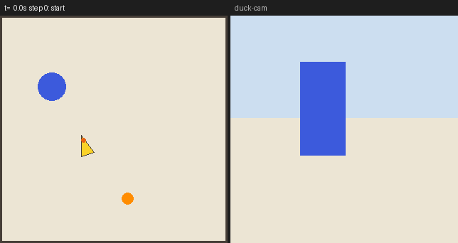
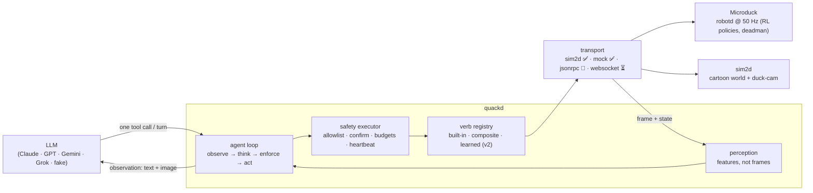

<p align="center">
  
</p>

<h1 align="center">quackd</h1>

<p align="center"><strong>Give your Microduck a brain. Any LLM, one <code>.duck</code> file.</strong> 🦆🧠</p>

<p align="center">
  <a href="https://github.com/rokbenko/quackd/actions/workflows/ci.yml"></a>
  <a href="https://pypi.org/project/quackd/"></a>
  <a href="LICENSE"></a>
  <a href="https://github.com/pollen-robotics/microduck#readme"></a>
</p>

<p align="center">
  
  <br>
  <sub><code>quackd record find-and-kick --seed 3</code> — the built-in simulator driven by the <em>scripted</em> pilot (no API key). Same verbs, same safety layer, same perception as a real model run; see <a href="docs/assets/README.md">docs/assets</a>.</sub>
</p>

Pilot [Pollen Robotics' $399 Microduck](https://pollen-robotics.com/microduck/) biped with any LLM (Claude, GPT, Gemini, Grok) via `.duck` skill files and MCP. Built-in simulator — no hardware needed.

## Quickstart

```bash
uvx --from "quackd[anthropic]" quackd run find-and-kick --provider anthropic     # needs ANTHROPIC_API_KEY (env or .env)
uvx quackd run find-and-kick --provider fake                                      # no key: the scripted pilot
open runs/*/run.gif                                                               # every run leaves a GIF + transcript
```

Under a minute from install to GIF. `--transport sim2d` is the default. Copy [`.env.example`](.env.example) to `.env` for keys; `quackd doctor` tells you what is missing.

## How it works

Three loops, three rates, three owners. The LLM decides **what**; the steering loop handles **how to get there**; the robot's RL policies keep it **upright**.

| Loop | Rate | Where | Who |
|---|---|---|---|
| Reflexes | 50 Hz | onboard `robotd` | RL policies: balance, gait, stand-up. quackd never touches this. |
| Steering | 5–20 Hz | quackd process | local perception + composite verbs (`walk_to` closes the approach loop from detections) |
| Deliberation | ~0.2–1 Hz | LLM | reads a frame + state, picks the next **verb**, checks the success criteria |



Every action is a **verb** resolved from a registry: `walk`, `sit`, `stand`, `kick`, `grab`, `stand_up`, `stop`, `quack`, `gaze`, `get_frame` map 1:1 to shipped robot behaviours; `search_scan`, `walk_to`, `approach_and` are composites written in plain Python. Details in [docs/architecture.md](docs/architecture.md).

## Providers

| Provider | Extra | Run |
|---|---|---|
| Claude | `quackd[anthropic]` | `uvx --from "quackd[anthropic]" quackd run find-and-kick --provider anthropic` |
| GPT | `quackd[openai]` | `uvx --from "quackd[openai]" quackd run find-and-kick --provider openai` |
| Gemini | `quackd[gemini]` | `uvx --from "quackd[gemini]" quackd run find-and-kick --provider gemini` |
| Grok | `quackd[grok]` | `uvx --from "quackd[grok]" quackd run find-and-kick --provider grok` |
| fake (scripted, no key) | — | `uvx quackd run find-and-kick --provider fake` |

Keys: `ANTHROPIC_API_KEY`, `OPENAI_API_KEY`, `GEMINI_API_KEY`, `XAI_API_KEY`. Override the model with `--model` or `QUACKD_MODEL` (see [docs/faq.md](docs/faq.md) for defaults and caveats).

## The `.duck` file

YAML frontmatter is the **contract the executor enforces**; the Markdown body is what the LLM reads. Deliberately SKILL.md-shaped.

```markdown
---
duck: 0
name: find-and-kick
description: Search the area for a ball, walk to it, kick it.
verbs:
  allow: [search_scan, walk_to, kick, quack, get_frame, stop]
  confirm: []                       # verbs that ask a human y/N first
budgets: {max_steps: 40, max_minutes: 5, max_llm_calls: 40}
success:
  - Ball displaced more than 0.3 m in sim, or human confirms the kick landed.
abort_when: [Battery below 15%, Same verb fails 3 times in a row]
persona: Determined and cheerful. Quack once when you succeed.
---
# Task
Find the ball and kick it.
## Strategy
1. `search_scan`. 2. `walk_to` the ball, stop ~0.25 m away. 3. `kick`. 4. Verify; retry if it did not move.
```

`quackd validate ducks/*.duck` fails fast with field-level errors. Full spec: [docs/duck-spec.md](docs/duck-spec.md). Five starters live in [`ducks/`](ducks/) and ship inside the package.

## Pilot it from Claude (MCP)

```bash
claude mcp add quackd -- uvx quackd serve-mcp --transport sim2d
```

Then: *"List the duck's verbs, then find the ball and kick it."* Works in Claude Code and Claude Desktop; the same allowlists and budgets apply. [docs/mcp.md](docs/mcp.md).

## Status

| Piece | Status |
|---|---|
| `sim2d` built-in simulator (default) | ✅ 10/10 seeds on `find-and-kick`, ~2 s each, GIF + transcript per run |
| MCP server (`quackd serve-mcp`) | ✅ Claude Code / Claude Desktop, verified config |
| Providers: anthropic · openai · gemini · grok · fake | ✅ code paths tested offline; real-model hero recording pending an API key |
| Real robot over JSON-RPC (`--transport jsonrpc`) | 🧪 experimental — method names verified against upstream `duck-ipc-proto` v16, never run on hardware |
| WebSocket agent gateway (`--transport websocket`) | ⏳ stub tracking upstream's draft ([architecture.md §5.3](https://github.com/pollen-robotics/microduck/blob/main/docs/design/architecture.md)) |
| Learned verbs | 🗺️ v2 — interface + docs only ([docs/learned-verbs.md](docs/learned-verbs.md)) |

What we assume about upstream and why: [docs/transport-status.md](docs/transport-status.md). `quackd doctor` prints the same list on your machine.

## Roadmap

- **v0.2** — validated hardware transport when Microducks ship (Christmas 2026): run `jsonrpc` against a real `robotd`, flip rows from 🧪 to ✅, adopt upstream's WebSocket surface when it lands.
- **v1** — hardware-verified demos: the five starter ducks on a real duck, on video.
- **v2 — learned verbs.** LLM-written rewards ([Eureka](https://eureka-research.github.io/) / [DrEureka](https://eureka-research.github.io/dr-eureka/)-style) train new policies in `microduck_rl` that register as one more verb. The registry hook exists today; the training loop does not.

## Community & credits

**Add your `.duck` to [`ducks/`](ducks/) — PRs welcome.** That is the community funnel and the KPI we care about. See [CONTRIBUTING.md](CONTRIBUTING.md) for how to add a verb or a duck.

They built the duck; quackd is the brain. Upstream credit and thanks to Pollen Robotics for [microduck](https://github.com/pollen-robotics/microduck) (the onboard daemon stack and its JSON-RPC contract) and [microduck_rl](https://github.com/pollen-robotics/microduck_rl) (the training stack behind the policies the robot runs). Community: the Pollen Robotics Discord linked from the [upstream README](https://github.com/pollen-robotics/microduck#readme).

## Safety

Run on the floor, not a table. Keep pets and kids clear of `kick`. On hardware the gamepad preempts remote control and `robotd` is the safety authority; quackd adds a heartbeat, a kill switch (Ctrl-C or `q`), allowlists, confirm gates and budgets on top — see [docs/safety.md](docs/safety.md). You are responsible for your robot.

quackd is an independent community project, not affiliated with or endorsed by Pollen Robotics or Hugging Face. "Microduck" is used nominatively to describe compatibility. No Pollen Robotics assets are distributed here.

Licensed under [Apache-2.0](LICENSE) · [NOTICE](NOTICE) · [docs/licenses.md](docs/licenses.md)
