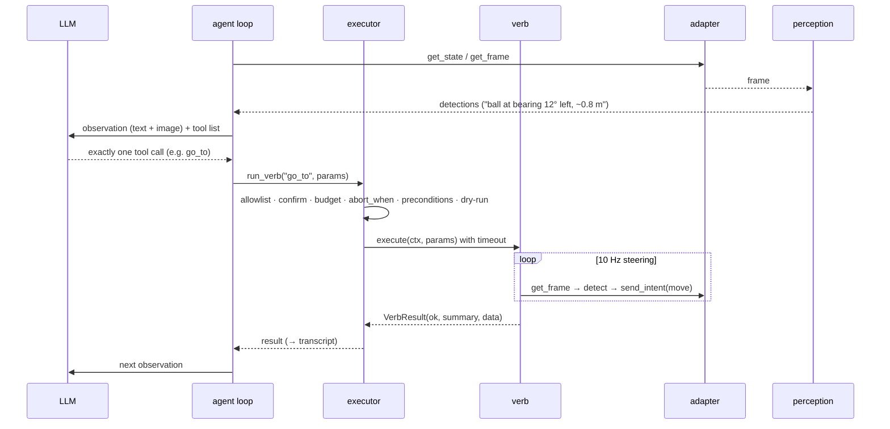

# Architecture

quackd is the brain daemon Microduck was missing, and since 0.4 a brain for any small robot
that has an adapter. This page is the map; the ADRs in [`adr/`](adr/) are the reasons.

## Three loops

| Loop | Rate | Where | Owner |
|---|---|---|---|
| Reflexes | the body's own (50 Hz on both ducks) | below quackd: `robotd` on a Microduck, quackd's own bridge daemon on an Open Duck, the daemon on a Reachy Mini, the position controller on an arm, the driver on a base | the robot's own controllers: RL policies (ONNX) for balance, gait and stand-up on both ducks, a learned pick policy on the arm when one is loaded. quackd writes none of this control code. Since 0.5 it does *host* the loop on one body, the Open Duck Mini, whose runtime has no network API to talk to, and even there quackd only supplies the seven numbers a gamepad would ([ADR-0024](adr/0024-open-duck-mini.md)). |
| Steering | 5–20 Hz | quackd process | perception + composite verbs. `go_to` (alias `walk_to`) closes the approach loop on detections. |
| Deliberation | ~0.2–1 Hz | LLM | reads frame summary + state + last result, picks one **verb**, judges success. |

Every design choice defends this separation: the LLM's only output is one tool call per
turn; composites never call the LLM; verbs send *intents*, never joint targets; the
adapter owns time, so the steering loop runs at sim speed in the simulator and in real
time on hardware without changing verb code. ([ADR-0003](adr/0003-three-loops.md))

Since 0.4 the robot side is an **adapter** that declares a **manifest**: what body it has,
which intents and sensors, which verbs. The registry, the tool list, the allowlist universe
and the system prompt are all built from that manifest at connect time; a verb that is not
in it does not exist. The Microduck is the first adapter, wrapping the four transports
below unchanged. ([ADR-0017](adr/0017-robot-adapters-and-manifest.md),
[design/multi-robot.md](design/multi-robot.md))

## Modules

| Path | Why it exists |
|---|---|
| `quackd/cli.py` | The front door: `run · validate · doctor · serve-mcp · list-verbs · list-adapters · record · discover · announce`. `--robot <adapter>:<backend>` everywhere, with `--address`, `--camera-url` and `--token` for a real robot. |
| `quackd/duckfile/` | The `.duck` contract (v0 and v1): strict pydantic frontmatter, parser, generated `schema.json`, `validate.py` (a task against one or more manifests). |
| `quackd/adapters/` | `RobotManifest` (data: what a robot is and can do), the `RobotAdapter` protocol, the factory behind `--robot`, and one package per robot: `microduck/` wraps the four transports and declares its manifest and extension verbs; `reachy_mini/` is a stationary head (`sim2d`, `mock`, `sdk`) with its own `upstream_api.py` ([adapters/reachy_mini.md](adapters/reachy_mini.md)); `lerobot/` is a desktop arm (`mock`, `real`, [adapters/lerobot.md](adapters/lerobot.md)); `rosbridge/` is any wheeled base over rosbridge (`mock`, `ws`, [adapters/rosbridge.md](adapters/rosbridge.md)); `open_duck/` is an Open Duck Mini v2 (`sim2d`, `mock`, `bridge`, [adapters/open_duck.md](adapters/open_duck.md)), the one body whose robot side quackd also ships, in `bridge/open_duck/`, because its runtime has no network control API. Every SDK-touching package owns an `upstream_api.py` and a containment test. |
| `quackd/verbs/` | `core.py`: the verbs any robot can carry and what each requires; `aliases.py`: the one alias table; `registry.py`: built from a manifest at connect time; `learned.py`: the v2 interface. |
| `quackd/safety.py` | The layer that does not trust the LLM: `Executor`, `Budget`, `Heartbeat`, `KillSwitch`. Preconditions arrive from the adapter; the executor spells none. |
| `quackd/transport/` | The Microduck backend layer: the `DuckTransport` protocol; `sim2d`, `mock`, `jsonrpc` (experimental), `websocket` (stub); `upstream_api.py` is the only file allowed to spell a Microduck upstream method. |
| `quackd/sim2d/` | The cartoon world, two renders (top-down, duck-cam), the GIF recorder, the optional live window. |
| `quackd/perception/` | `Detection` + `Detector`; the HSV colour-blob default; the lazy YOLO extra. |
| `quackd/agent/` | The loop, the prompts, the transcript, and one provider per vendor behind `LLMProvider`. |
| `quackd/mcp_server.py` | A robot, or a fleet (`--robots`), as MCP tools: six `robot_*` tools through one executor per robot, the eight `duck_*` tools kept as aliases of the default robot. |
| `bridge/open_duck/` | **The only quackd code that runs on a robot.** Two daemons for an Open Duck Mini v2's Raspberry Pi: the bridge, which is upstream's own walk loop with the gamepad it reads replaced by a socket, and the camera server, which serves one JPEG over HTTP. Standard library plus numpy, never imported by quackd, shipped in the sdist and never in the wheel ([ADR-0024](adr/0024-open-duck-mini.md)). |
| `quackd/lan/` | LAN discovery over zeroconf (`_quackd._tcp.local.`): a pure TXT wire format, `announce`, `discover`; behind `quackd[lan]` ([lan.md](lan.md)). |
| `quackd/flock/` | Many robots on one task: the in-process `Bus`, the typed messages, the Contract Net `Auction` and the role auction, the deterministic coordinator, the scripted member FSM, the one-call planner and the runner that judges from ground truth ([flock.md](flock.md)). |
| `quackd/flock/mqtt_bus.py` | The flock `Bus` protocol over an MQTT broker, library only; the in-process bus stays the default. |
| `quackd/doctor.py` | What can run here and what we are assuming about the robot. |

## A turn, concretely

1. **Observe.** `transport.get_state()` → `DuckState`; `transport.get_frame()` → PIL image →
   `detector.detect()` → `[Detection]`. The frame is saved to `runs/<ts>/frames/`.
2. **Think.** The provider gets: the system prompt (contract in prose + the `.duck` body),
   the vendor-neutral history (`Exchange` = observation + decision), and the tool list
   (allowed verbs' JSON schemas + `declare_success` / `declare_failure`). Only the last two
   observations keep their images. The provider must return one tool call.
3. **Enforce.** Zero tool calls → one re-prompt, then failure. Several → the first. Then
   `Executor.run_verb`: abort flag → allowlist → params → confirm → budget → machine-enforced
   `abort_when` → preconditions → dry-run → execute with timeout.
4. **Act.** The verb runs; composites loop on the camera at 10 Hz; `move` re-sends its
   velocity every 100 ms to feed the robot's deadman.
5. **Record.** `transcript.jsonl` gets `observation`, `llm` (with usage), `verb` events
   (`name` as called plus `canonical`); `summary.json` at the end; `run.gif` from the
   recorder on sim2d.

Step 0, before all of that: the loop calls `connect()` and, when an adapter answers with a
manifest, builds the registry from it (`registry_from_manifest`). A bare transport answers
`None` and gets the Microduck vocabulary, which is why every 0.3 test path is unchanged.

Outcomes: `success` / `failure` (the LLM's claim via the meta tools), `budget`, `aborted`
(heartbeat, kill switch, `abort_when`). In sim the run summary also carries ground truth
(`final_state.extras.ball_displacement_m`) so tests judge the claim.

## Transcript format

One JSON object per line: `{"t": seconds, "kind": ..., ...}` with kinds `run_start`
(contract, system prompt, tools), `observation`, `llm` (text, tool_calls, usage,
stop_reason), `enforce`, `verb` (name, params, ok, summary, data), `declare`, `frame`,
`run_end`. Example: [`assets/transcript-example.jsonl`](assets/transcript-example.jsonl).

## Where the seams are

- **Providers** — add a file under `agent/providers/`, one line in `factory.py`.
- **Detectors** — implement `detect(image) -> list[Detection]`; upstream's future feature
  stream becomes one more detector that reads a socket.
- **Robots** — a package under `adapters/` with `describe()` (the static manifest),
  `make()` (a `RobotAdapter`), `implementations()` (its own verbs) and `conditions()`
  (its named preconditions); keep upstream names in its own `upstream_api.py`.
- **Learned verbs** — `register_learned_verb(registry, spec, runner)`; see
  [learned-verbs.md](learned-verbs.md).
