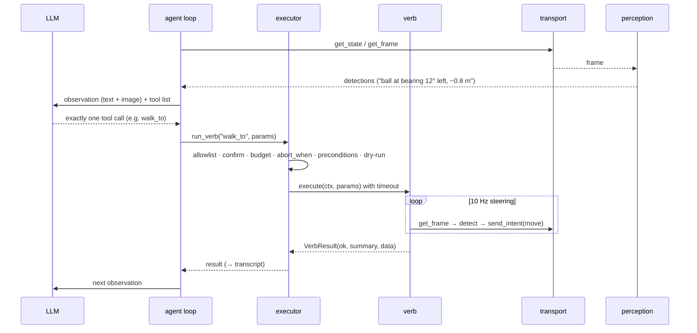

# Architecture

quackd is the brain daemon Microduck was missing. This page is the map; the ADRs in
[`adr/`](adr/) are the reasons.

## Three loops

| Loop | Rate | Where | Owner |
|---|---|---|---|
| Reflexes | 50 Hz | onboard `robotd` | RL policies (ONNX): balance, gait, stand-up. quackd never touches this. |
| Steering | 5–20 Hz | quackd process | perception + composite verbs. `walk_to` closes the approach loop on detections. |
| Deliberation | ~0.2–1 Hz | LLM | reads frame summary + state + last result, picks one **verb**, judges success. |

Every design choice defends this separation: the LLM's only output is one tool call per
turn; composites never call the LLM; built-ins send *intents*, never joint targets; the
transport owns time, so the steering loop runs at sim speed in the simulator and in real
time on hardware without changing verb code. ([ADR-0003](adr/0003-three-loops.md))

## Modules

| Path | Why it exists |
|---|---|
| `quackd/cli.py` | The front door: `run · validate · doctor · serve-mcp · list-verbs · record`. |
| `quackd/duckfile/` | The `.duck` contract: strict pydantic frontmatter, parser, generated `schema.json`. |
| `quackd/verbs/` | The registry (one list for the LLM, the allowlist, MCP and v2), built-ins, composites, the learned-verb interface. |
| `quackd/safety.py` | The layer that does not trust the LLM: `Executor`, `Budget`, `Heartbeat`, `KillSwitch`. |
| `quackd/transport/` | One `DuckTransport` protocol; `sim2d`, `mock`, `jsonrpc` (experimental), `websocket` (stub); `upstream_api.py` is the only file allowed to spell an upstream method. |
| `quackd/sim2d/` | The cartoon world, two renders (top-down, duck-cam), the GIF recorder, the optional live window. |
| `quackd/perception/` | `Detection` + `Detector`; the HSV colour-blob default; the lazy YOLO extra. |
| `quackd/agent/` | The loop, the prompts, the transcript, and one provider per vendor behind `LLMProvider`. |
| `quackd/mcp_server.py` | The duck as MCP tools, through the same executor. |
| `quackd/doctor.py` | What can run here and what we are assuming about the robot. |

## A turn, concretely

1. **Observe.** `transport.get_state()` → `DuckState`; `transport.get_frame()` → PIL image →
   `detector.detect()` → `[Detection]`. The frame is saved to `runs/<ts>/frames/`.
2. **Think.** The provider gets: the system prompt (contract in prose + the `.duck` body),
   the vendor-neutral history (`Exchange` = observation + decision), and the tool list
   (allowed verbs' JSON schemas + `declare_success` / `declare_failure`). Only the last two
   observations keep their images. The provider must return one tool call.
3. **Enforce.** Zero tool calls → one re-prompt, then failure. Several → the first. Then
   `Executor.run_verb`: abort flag → allowlist → params → confirm → budget → machine-enforced
   `abort_when` → preconditions → dry-run → execute with timeout.
4. **Act.** The verb runs; composites loop on the camera at 10 Hz; built-ins re-send `move`
   every 100 ms to feed the robot's deadman.
5. **Record.** `transcript.jsonl` gets `observation`, `llm` (with usage), `verb` events;
   `summary.json` at the end; `run.gif` from the recorder on sim2d.

Outcomes: `success` / `failure` (the LLM's claim via the meta tools), `budget`, `aborted`
(heartbeat, kill switch, `abort_when`). In sim the run summary also carries ground truth
(`final_state.extras.ball_displacement_m`) so tests judge the claim.

## Transcript format

One JSON object per line: `{"t": seconds, "kind": ..., ...}` with kinds `run_start`
(contract, system prompt, tools), `observation`, `llm` (text, tool_calls, usage,
stop_reason), `enforce`, `verb` (name, params, ok, summary, data), `declare`, `frame`,
`run_end`. Example: [`assets/transcript-example.jsonl`](assets/transcript-example.jsonl).

## Where the seams are

- **Providers** — add a file under `agent/providers/`, one line in `factory.py`.
- **Detectors** — implement `detect(image) -> list[Detection]`; upstream's future feature
  stream becomes one more detector that reads a socket.
- **Transports** — implement `DuckTransport`; keep upstream names in `upstream_api.py`.
- **Learned verbs** — `register_learned_verb(registry, spec, runner)`; see
  [learned-verbs.md](learned-verbs.md).
